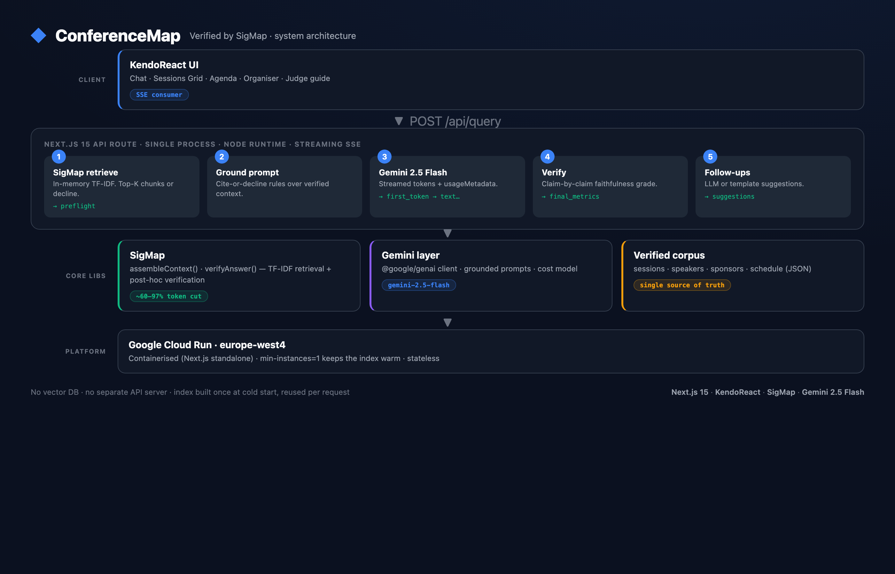

# Architecture — ConferenceMap

ConferenceMap is a single Next.js 15 process. There is no separate API server,
no vector database, and no external state store. The retrieval index lives in
module memory, built once at cold start and reused for every request.



## Request flow

```
Browser (KendoReact UI)
   │  POST /api/query  { query }
   ▼
Next.js API route (Node runtime, SSE stream)
   │
   ├─ 1. SigMapIndex.assembleContext(query)      in-memory TF-IDF
   │        → top-K chunks, or canAnswer:false   (decline = zero hallucination)
   │        → emits  preflight  (token reduction, citations)
   │
   ├─ 2. buildConferencePrompt(context, query)   grounded, cite-or-decline rules
   │
   ├─ 3. Gemini 2.5 Flash  generateContentStream  @google/genai
   │        → emits  first_token  then  text…     (streamed token-by-token)
   │        → usageMetadata captured from chunks
   │
   ├─ 4. verifyAnswer(answer, chunks)            post-hoc faithfulness check
   │        → emits  final_metrics  (grounded claims, confidence, cost)
   │
   └─ 5. follow-ups (LLM or template)            → emits  suggestions
   ▼
SSE events → TokenPanel + chat UI
```

## The SSE event contract

`/api/query` returns `text/event-stream`. Each line is `data: <json>` with a
`type` discriminator:

| `type` | When | Payload |
|---|---|---|
| `preflight` | after retrieval, before the LLM | `sigmap` metrics: naive vs assembled tokens, reduction %, citations |
| `no_context` | retrieval found nothing | decline `message` + sigmap stats |
| `first_token` | first Gemini chunk | `latencyMs`, `naiveEstimateMs` |
| `text` | each Gemini chunk | `content` (append to answer) |
| `final_metrics` | stream complete | full `QueryMetrics`: gemini usage, faithfulness, cost |
| `suggestions` | after metrics | `items: string[]` follow-up questions |
| `error` | any failure | `message` |
| `done` | terminal | — |

## Layers

| Layer | Responsibility | Key files |
|---|---|---|
| **UI** | Chat, grid, agenda, dashboard, judge guide | `src/components/*`, `src/app/*/page.tsx` |
| **API** | SSE pipeline, AI session filter | `src/app/api/query/route.ts`, `src/app/api/sessions/route.ts` |
| **SigMap** | TF-IDF retrieval + faithfulness | `src/lib/sigmap/{index,ingest,verify,types}.ts` |
| **LLM** | Gemini client, prompts, costing | `src/lib/gemini/{client,prompts}.ts` |
| **Data** | Verified conference corpus | `src/lib/corpus/*.json` |

## SigMap in two parts

**Retrieval (`assembleContext`)** — tokenise the query, score every corpus
document by summed TF-IDF, take the top-K above a relevance threshold, and
compact each chunk to ≤350 chars. If nothing clears the threshold it returns
`canAnswer:false` and the pipeline declines instead of calling the LLM. This is
the structural guarantee against hallucination: the model is never asked a
question it has no grounding for.

**Verification (`verifyAnswer`)** — after generation, extract factual claims
(proper names, times, room/track references, day markers) from the answer and
check each against the assembled context. The ratio grounded/total becomes a
HIGH / MEDIUM / LOW / NONE confidence grade shown in the trust panel.

## Why this shape

- **In-memory index** — the corpus is small (tens of KB). TF-IDF over it is
  sub-millisecond, so a vector DB would add latency and ops for no benefit.
- **Single process** — Next.js API routes run server-side on Cloud Run; the
  index is a module singleton, built once per cold start.
- **Streaming SSE** — first token in ~0.3–2s; metrics and follow-ups arrive
  after without blocking the answer.
- **Stateless** — agenda lives in `sessionStorage`; nothing to persist for the
  demo. Cloud Run with `min-instances=1` keeps the index warm.

## Deploy

Containerised (multi-stage `Dockerfile`, Next.js standalone output) to Google
Cloud Run in `europe-west4`. See [`cloudbuild.yaml`](cloudbuild.yaml) and the
README for commands.
